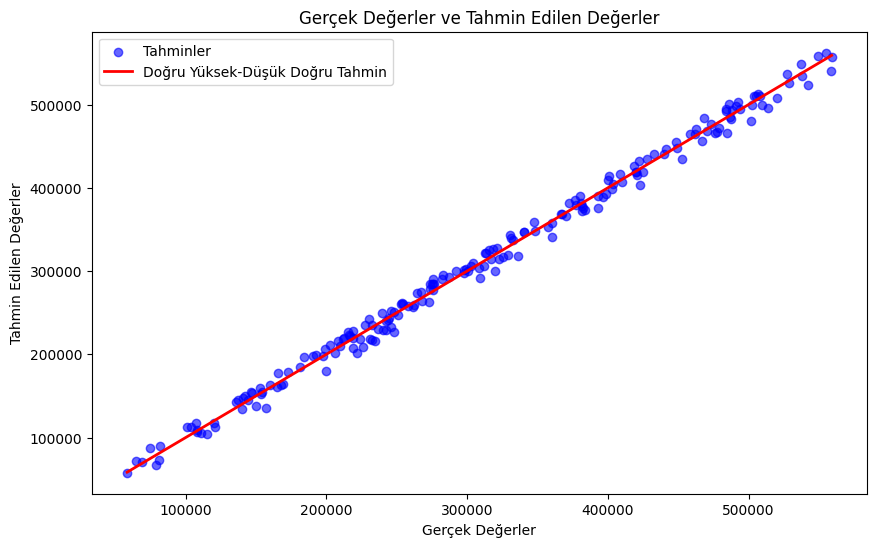

# Araba Fiyat Tahmini Analizi

**Çalışmanın video linki:** [YouTube Video](https://www.youtube.com/watch?v=xmD_rws08qM&t=2s)

## Veri Seti ve Algoritmaların Analizi

Veri seti üzerinde üç adet algoritma kullanılmıştır: **Lineer Regresyon**, **Random Forest** ve **XGBoost** algoritmaları.

### Veri Seti Analizi

Veri seti 1000 satır ve 14 sütundan oluşmaktadır. Sütun isimleri şunlardır:

- v.id  
- on road old  
- on road now  
- years  
- km  
- rating  
- condition  
- economy  
- top speed  
- hp  
- torque  
- current price  
- car_brand  
- car_model  

`v.id` ve `car_model` sütunları kaldırılmıştır. Sonrasında, `car_brand` değişkeni `object` tipinde olduğu için **one-hot encoder** yöntemi ile sayısal değere dönüştürülmüştür. Eksik değerler o sütunun ortalama değeri ile doldurulmuştur.

Aşağıda verilen korelasyon matrisine göre:
- **current price** ve **km** arasında oldukça yüksek negatif ilişki,
- **current price** ve **on road old** ile **current price** ve **on road now** arasında pozitif ilişkiler gözlemlenmiştir.

### Algoritmaların Analizi

Algoritma analizlerinde kullanılacak metriklerin açıklamaları:

- **MSE (Mean Squared Error):** Modelin tahminlerinin gerçek değerlerden ne kadar saptığını ölçen bir metriktir. Daha düşük MSE, daha iyi bir model anlamına gelir.
- **RMSE (Root Mean Squared Error):** MSE'nin kareköküdür ve modelin ortalama hatasını daha anlaşılır bir birimde ifade eder. Daha düşük RMSE, modelin iyi performans gösterdiğini işaret eder.
- **R² (R-squared) Score:** Modelin doğruluğunu ve bağımsız değişkenlerin bağımlı değişkeni açıklama gücünü gösterir. Sonuç 1'e ne kadar yakınsa, model o kadar iyi açıklama yapar.

#### 1. Lineer Regresyon

- **MSE:** 83,771,648.16
- **RMSE:** 9,152.69
- **R² Score:** 0.995
- **Hata Oranı:** 2.94%
- **Eğitim Zamanı:** 0.0062 saniye

R² ve hata oranı değerleri gayet güzel gözükmektedir. MSE ve RMSE değerlerinin bu kadar büyük çıkmasının sebebi, **current price** değişkeninin verilerinin 100.000 ile 800.000 arasında olmasıdır.

Grafikten de anlaşılacağı üzere, model gayet iyi çalışmaktadır ve tahminler gerçek değerlere yakın değerlerdir.

#### 2. Random Forest

- **MSE:** 373,158,437.66
- **RMSE:** 19,317.31
- **R² Score:** 0.9778
- **Hata Oranı:** 6.20%
- **Eğitim Zamanı:** 0.7424 saniye

R² ve hata oranı değerleri lineer regresyona göre daha kötü olsa da, Random Forest algoritması da oldukça iyi sonuçlar vermektedir. MSE ve RMSE değerlerinin büyük çıkmasının sebebi yine **current price** değişkeninin verilerinin yüksek olmasıdır.

Grafikten de anlaşılacağı üzere, Random Forest modelinin tahminleri gerçek değerlere yakın değerlerdir.

#### 3. XGBoost

- **MSE:** 208,413,880.74
- **RMSE:** 14,436.55
- **R² Score:** 0.9876
- **Hata Oranı:** 4.63%
- **Eğitim Zamanı:** 0.1595 saniye

XGBoost'un R² ve hata oranı değerleri lineer regresyon ve Random Forest arasında yer almaktadır. Bu algoritma da oldukça başarılıdır. MSE ve RMSE değerlerinin yüksek olmasının sebebi yine **current price** değişkeninin yüksek değerler almasıdır.

Grafikten de anlaşılacağı üzere, XGBoost modelinin tahminleri gerçek değerlere yakın değerlerdir.

### Algoritmaların Karşılaştırılması

Algoritmaları karşılaştıracak olursak:
- MSE, RMSE, R² Score, hata oranı ve çalışma zamanı verileri göz önüne alındığında **Lineer Regresyon** en iyi sonuçları vermektedir.
- Ardından **XGBoost**, ve son olarak **Random Forest** gelmektedir.

Yukarıdaki grafik ile 3 modelin de verilerini birlikte görüyoruz. 3 model de gerçek değerlere yakın sonuçlar vermektedir.
  
Modeller arasındaki farklar oldukça küçüktür ve her biri gayet başarılıdır. Ancak, rasgele verilerle yapılan tahminlerde **Random Forest** algoritması daha doğru sonuçlar vermiştir. Bu nedenle **Random Forest** algoritması tercih edilebilir.

#### Veri ile Tahminler:
- **Lineer Regresyon Tahmini:** 364,881.29
- **Random Forest Tahmini:** 362,734.14
- **XGBoost Tahmini:** 364,700.16
- **Gerçek Fiyat:** 351,318

#### Yeni Veri ile Tahminler:
- **Lineer Regresyon Tahmini:** 280,386.72
- **Random Forest Tahmini:** 283,688.99
- **XGBoost Tahmini:** 287,435.10
- **Gerçek Fiyat:** 285,001
