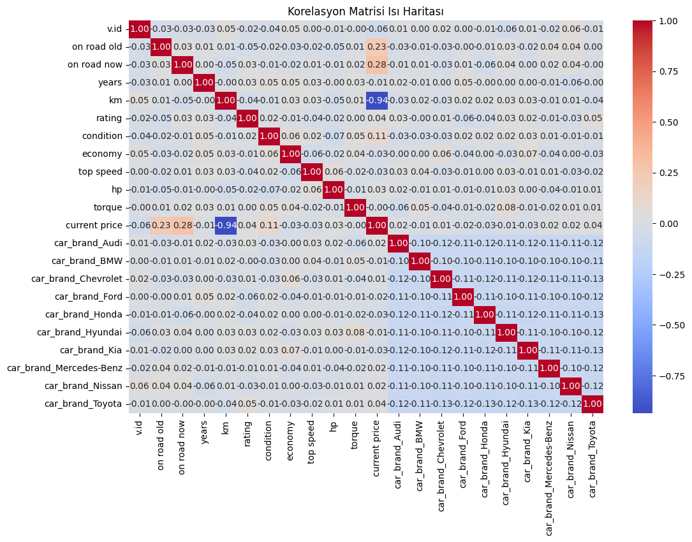
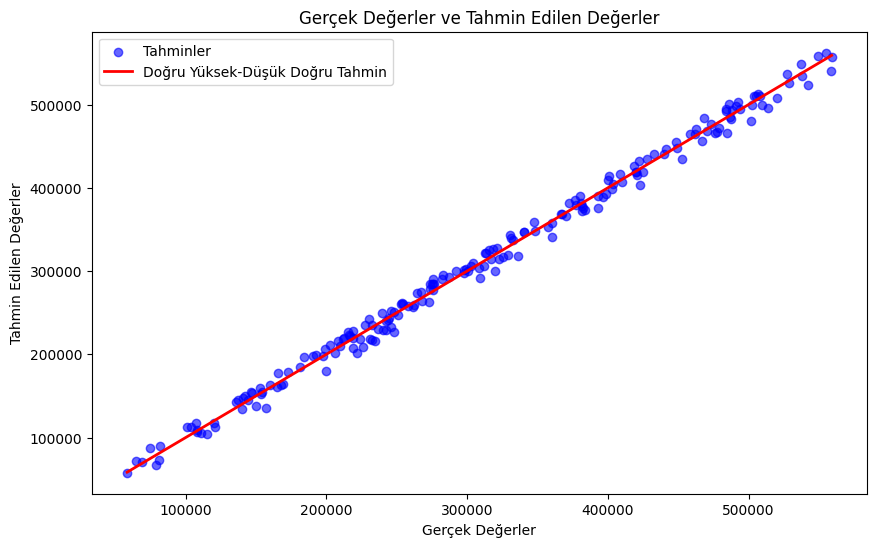
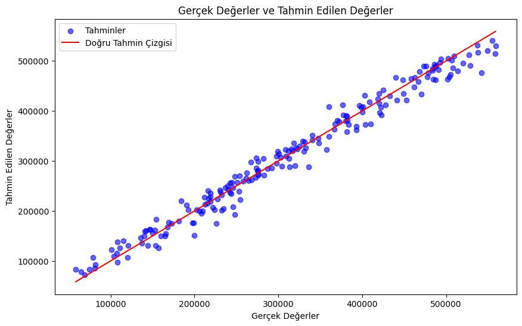

# Araba_Fiyat_Tahmini_Analizi
Çalışmanın video linki: https://www.youtube.com/watch?v=xmD_rws08qM&t=2s

##Veri Seti ve Algoritmaların Analizi
Veri seti üzerinde 3 adet algoritma kullanılmıştır. Bunlar; lineer regresyon, random forest ve xgboost algoritmalarıdır.

###Veri Seti Analizi
Veri seti 1000 satır ve 14 sütundan oluşmaktadır. Sütun isimleri;
  v.id             
  on road old      
  on road now      
  years            
  km               
  rating           
  condition        
  economy          
  top speed        
  hp              
  torque           
  current price    
  car_brand        
  car_model 
şeklindedir. v.id ve car_model sütunları droplanmıştır. Sonrasında car_brand değişkeni object tipinde olduğu için one-hot encoder yöntemi ile sayısal değere dönüştürme işlemi yapılmıştır. Eksik değerler o sütunun ortalama verisi ile doldurulmuştur. 

Aşağıda verilen korelasyon matrisine göre current price-km arasında oldukça yüksek negatif ilişki, current price-on road old ve current price-on road now arasında pozitif bir ilişki olduğu görülmektedir.

###Algoritmaların Analizi
  Algoritma analizlerinde kullanılacak değişkenleri açıklamaları şu şekildedir:
  ->MSE, modelin tahminlerinin gerçek değerlerden ne kadar saptığını ölçen bir metriktir. Her bir tahminin hata karelerinin ortalamasıdır. Daha düşük MSE, daha iyi bir model demektir.
  ->RMSE, MSE'nin kareköküdür ve modelin ortalama hatasını daha anlaşılır bir birimde ifade eder. MSE'ye benzer şekilde daha düşük RMSE, modelin iyi performans gösterdiğini işaret eder.
  ->$R^2$ score ,modelin doğruluğunu ve bağımsız değişkenlerin bağımlı değişkeni açıklama gücünü gösterir. Sonuç 1 değerine ne kadar yakında model o kadar güzel açıklar. 
  
  ####1.Lineer Regresyon

  MSE: 83771648.15887657
  RMSE: 9152.685297707803
  R2 Score: 0.9950168471121504
  Hata Oranı: 2.94%
  Eğitim Zamanı: 0.0062 saniye
  
  R2 score ve hata oranı değerleri gayet güzel gözükmekte, mse ve rmse değerlerinin bu kadar büyük çıkmasının sebebi current price değişkenimizin verilerinin 100.000-800.000 aralığında olmasından kaynaklıdır.  

Grafikten de anlaşılacağı üzere model gayet güzel çalışmaktadır, modelin tahminleri gerçek değerlere yakın değerlerdir.

  ####2.Random Forest

  MSE: 373158437.65914446
  RMSE: 19317.309275857868
  R^2 Score: 0.9778026863847783
  Hata Oranı: 6.20%
  Eğitim Zamanı: 0.7424 saniye

  R2 score ve hata oranı değerleri lineer regresyona göre daha kötü olmasına rağmen bu algoritma da gayet güzel çalışmaktadır. Mse ve rmse değerlerinin bu kadar büyük çıkmasının sebebi current price değişkenimizin verilerinin 100.000-800.000 aralığında olmasından kaynaklıdır.  

Grafikten de anlaşılacağı üzere model de gayet güzel çalışmaktadır, modelin tahminleri gerçek değerlere yakın değerlerdir.
  
  ####3.XGBoost

  MSE: 208413880.73970336
  RMSE: 14436.546704101482
  R2 Score: 0.987602509267738
  Hata Oranı: 4.63%
  Eğitim Zamanı: 0.1595 saniye

  Son modelimiz XGBoost'un R2 score ve hata oranı değerleri lineer regresyon ve random forest'ın ortasında diyebiliriz. Bu algoritma da gayet güzel çalışmaktadır. Mse ve rmse değerlerinin bu kadar büyük çıkmasının sebebi current price değişkenimizin verilerinin 100.000-800.000 aralığında olmasından kaynaklıdır.  

Grafikten de anlaşılacağı üzere model de gayet güzel çalışmaktadır, modelin tahminleri gerçek değerlere yakın değerlerdir.

###Algoritmaların Karşılaştırılması
  Son olarak algoritmaları karşılaştırmamız gerekirse;  
  Mse, rmse, R2 score, hata oranı ve çalışma zamanı verileri göz önüne alındığında lineer regresyon en iyi değerlere sahiptir, daha sonra xgboost ve son olarak random forest gelmektedir. Fakat modellerin ilgili skor değerleri arasında az miktarda farklar vardır. Bu 3 model de gayet güzel çalışmaktadır. 
  Hatta rastgele veriler girilmiş 3 model için de eğitilmiş ve bir fiyat tahmini yapılmıştır. Bu eğitim sonucunda Random forest  gerçek değere en yakın sonuçları vermiştir. Bu sonuçlara göre random forest algoritması tercih edilebilir.
    Veri ile Tahminler:
    Lineer Regresyon Tahmini: [364881.29325942]
    Random Forest Tahmini: [362734.135]
    XGBoost Tahmini: [364700.16]
    Gerçek fiyat: 351318
    ***
    Yeni Veri ile Tahminler:
    Linear Regression Tahmini: [280386.7206212]
    Random Forest Tahmini: [283688.995]
    XGBoost Tahmini: [287435.1]
    Gerçek fiyatı: 285001
    
